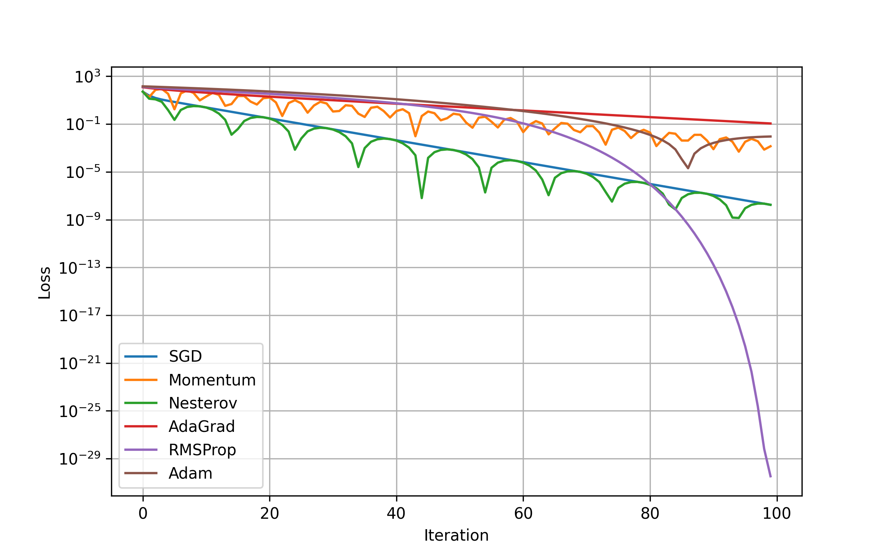
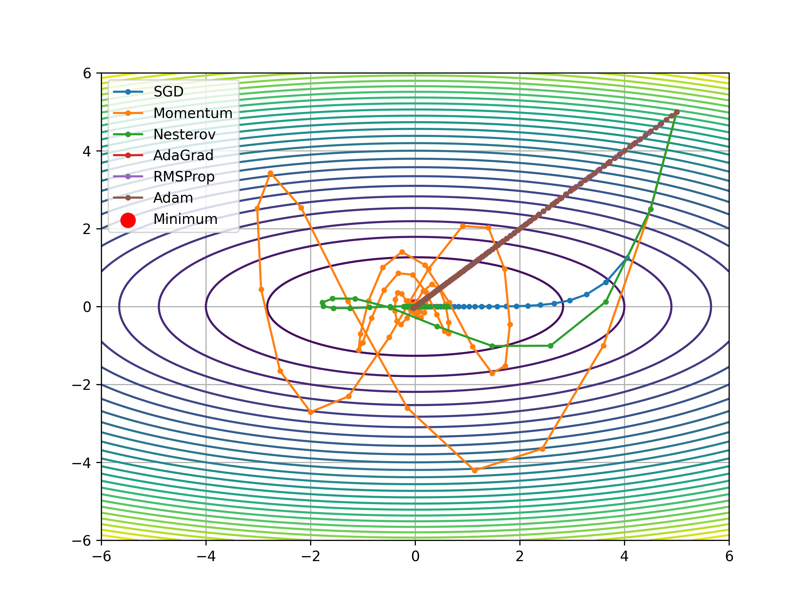

# Optimization Algorithms from Scratch

This project implements and compares popular optimization algorithms **from scratch using NumPy**, without relying on deep learning frameworks such as PyTorch or TensorFlow.

The goal is to analyze how different optimizers behave on a simple but challenging **elliptical quadratic function**, highlighting differences in convergence speed, stability, and trajectory behavior.

---

## Objective Function

We optimize the following 2D quadratic function:

 f(x, y) = a·x² + b·y² 


with parameters:
- `a = 1`
- `b = 5`

This creates an **elongated valley (canyon-shaped loss surface)**, which is known to be difficult for first-order optimization methods.

The global minimum is at:

 (x*, y*) = (0, 0) 


---

## Implemented Optimizers

All optimizers are implemented manually using NumPy:

- **SGD (Stochastic Gradient Descent)**
- **Momentum**
- **Nesterov Accelerated Gradient (NAG)**
- **AdaGrad**
- **RMSProp**
- **Adam**

All optimizers start from the same initial point for a fair comparison.

---

## Visualizations

### Loss vs Iteration

The following plot shows the loss value (log scale) versus iteration count for each optimizer:



---

### Optimization Trajectories

The contour plot below visualizes optimizer trajectories on the loss surface:



---

## Observations and Analysis

### SGD
- Slowest convergence among all methods.
- Exhibits strong zig-zag behavior in the steep y-direction.
- Highly sensitive to learning rate.
- Serves as a baseline optimizer.

### Momentum
- Faster convergence than SGD.
- Reduces zig-zagging but still overshoots in narrow valleys.
- Oscillatory behavior is visible in the trajectory plot.

### Nesterov Accelerated Gradient (NAG)
- More stable than classical Momentum.
- Uses look-ahead gradients to anticipate curvature changes.
- Converges faster and more smoothly in the canyon-shaped loss surface.

### AdaGrad
- Makes rapid progress during early iterations.
- Learning rate decays aggressively over time.
- Converges slowly near the optimum and may stall.

### RMSProp
- Fixes AdaGrad’s diminishing learning rate issue.
- Handles anisotropic curvature effectively.
- Demonstrates fast and stable convergence.

### Adam
- Combines momentum and adaptive learning rates.
- Converges quickly and robustly.
- Produces smooth and direct trajectories toward the minimum.

---

## Conclusion

- **Adaptive optimizers (RMSProp, Adam)** perform best on steep and elongated loss surfaces.
- **Momentum-based methods (Momentum, NAG)** significantly outperform vanilla SGD.
- **AdaGrad** is less suitable for problems requiring long-term learning.
- **Adam** provides the best balance of speed, stability, and robustness.

This experiment demonstrates why adaptive and momentum-based optimizers are widely used in modern machine learning.

---

## How to Run

```bash
pip install numpy matplotlib
python main.py
```

